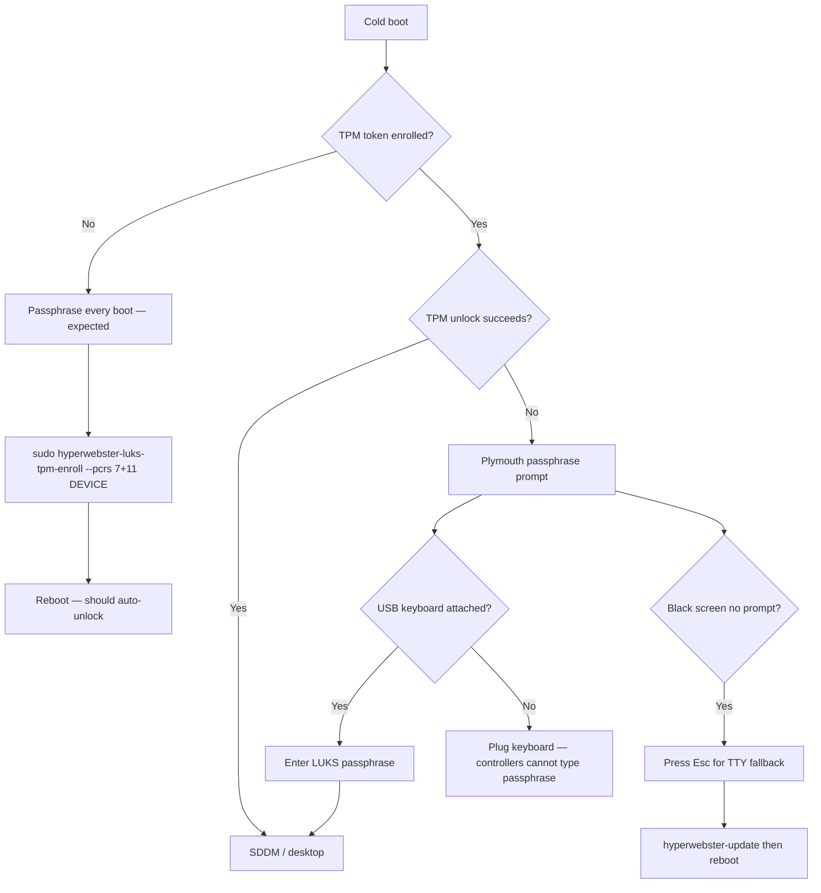

# Known issues and troubleshooting

## Settings pages show NoSignal or stay blank after a shell upgrade

**Symptom:** Settings → About says "NoSignal V1"; Updates, Additions, or Services
toggles (sudo / CachyOS) stop working; Additions list is empty.

**Cause:** The desktop shell package (`nosignal-shell`) ships upstream QML that
calls `nosignal-*` CLIs and `~/.local/state/nosignal/` paths. HyperWebster installs
`hyperwebster-*` tools and state under `~/.local/state/hyperwebster/`. A shell
package upgrade overwrites branded QML unless pacman hooks re-apply the patches.

**Fix:**

```sh
hyperwebster-update --no-packages --no-snapshot
```

Then restart the shell: `Ctrl+Super+Alt+R`.

Manual fallback:

```sh
sudo sh ~/.local/share/hyperwebster/shell-branding/install-shell-branding.sh
sh ~/.local/share/hyperwebster/updates-panel/install-updates-panel.sh
sh ~/.local/share/hyperwebster/additions-installer/install-additions-installer.sh
sh ~/.local/share/hyperwebster/wifi-password-retry/install-wifi-password-retry.sh
```

## Passwordless sudo toggle does not accept keyboard input

**Symptom:** Enabling "Passwordless sudo (15 min)" opens a terminal but typing does
nothing; the switch snaps back after failed attempts.

**Cause:** The prompt must use the `hyperwebster-sudo` window class (Hyprland
window rules float and focus it). Stale QML calling `TUI.float` or `nosignal-sudo`
breaks focus.

**Fix:** Run the shell-branding step above, then restart the shell.

## Wi-Fi wrong password cannot be retried from the UI

**Symptom:** After one bad WPA password, clicking the network again fails silently.

**Fix:** Run `sh ~/.local/share/hyperwebster/wifi-password-retry/install-wifi-password-retry.sh`
or full `hyperwebster-update --no-packages --no-snapshot`. Terminal workaround:
`nmcli connection delete "<SSID>"`.

## LUKS passphrase every boot (TPM not unlocking)

**Symptom:** Plymouth asks for a disk passphrase on every cold boot, or you only
see a black screen until you press Esc.

**Quick fix on the installed PC:**

```sh
hyperwebster-update
sudo hyperwebster-luks-tpm-status
sudo hyperwebster-luks-tpm-enroll --pcrs 7+11 /dev/disk/by-partuuid/YOUR-LUKS-PARTUUID
```

Replace `YOUR-LUKS-PARTUUID` with the LUKS partition from `lsblk -o NAME,PARTUUID,FSTYPE`
(root `crypto_LUKS` partition, usually `nvme0n1p2` or similar).

### Troubleshooting flow



| Check | Command |
|-------|---------|
| Full diagnostic | `sudo hyperwebster-luks-tpm-status` |
| TPM tokens on disk | `sudo systemd-cryptenroll --list /dev/disk/by-partuuid/…` |
| Initramfs hooks | `grep -E 'plymouth|sd-encrypt' /etc/mkinitcpio.conf` |
| Kernel LUKS params | `cat /proc/cmdline` — expect `rd.luks.name=` |

See [HARDWARE.md](HARDWARE.md#luks-tpm-auto-unlock) for enrollment details and PCR notes.
